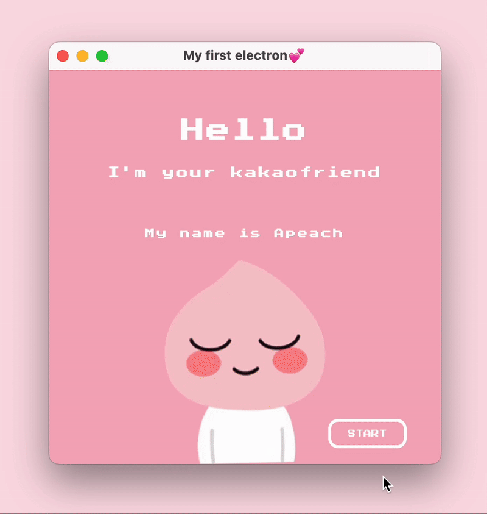

# Apeach
A cute virtual friend built with **Electron**, **HTML**, **CSS**, and **JavaScript** — feed **Apeach**, give her flowers, take selfies, or let her sleep.
# Introduction
**Apeach** is my very first project made with **Electron**.  

It’s a simple and lighthearted desktop app where users can interact with a cute character named **Apeach**.  

You can:  
🍣 Feed Apeach  
🌷 Give her a flower  
📸 Take a selfie  
💤 Let her sleep  

This project doesn’t aim to do anything serious — it was created purely for fun and to practice building desktop apps using **Electron**.
# Video

  

# Installation for Users
You don’t need any development tools — just download and run the app!  

Visit the Releases page on GitHub to get the latest version of **Apeach**:  
https://github.com/Tasya1711/Apeach/releases/tag/v1.0.0
# Installation for Developers
If you’d like to explore or modify the project:  

**Clone the repository**  
git clone https://github.com/Tasya1711/Apeach.git  
cd Apeach  

**Install dependencies**  
npm install  

**Start the app in development mode**  
npm start
